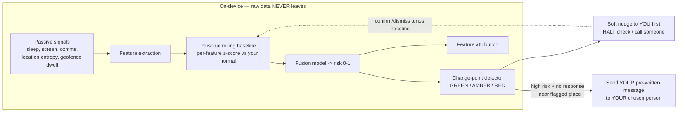
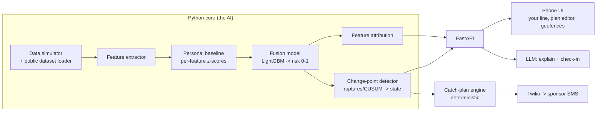
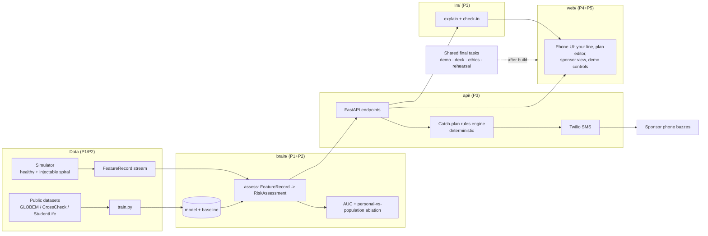
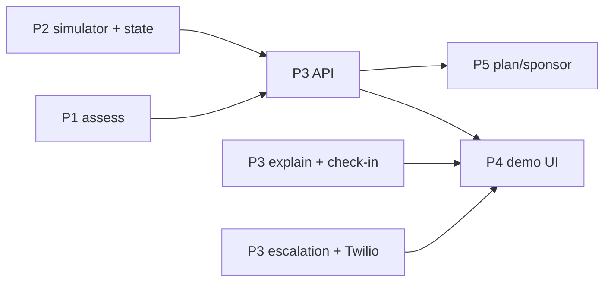

# Relapse Radar

**The early-warning system that catches you through the person you already trust — before you fall.**

> A privacy-first, on-device companion for people in **addiction recovery** that learns *your* normal phone behavior, spots a relapse spiral days early, and — using a plan *you wrote while you were well* — reaches out through the **one person you chose to catch you.**

---

## Table of contents

1. [TL;DR](#tldr)
2. [The honest verdict](#the-honest-verdict)
3. [The problem (Why)](#the-problem-why)
4. [Existing products + why the flagship died](#existing-products--why-the-flagship-died)
5. [The core insight](#the-core-insight)
6. [What it is (the product)](#what-it-is-the-product)
7. [How it works + is there real AI?](#how-it-works--is-there-real-ai)
8. [Tier 2 vs Tier 3](#tier-2-vs-tier-3)
9. [What it tracks (signals)](#what-it-tracks-signals)
10. [The data situation (verified)](#the-data-situation-verified)
11. [The demo (the money shot)](#the-demo-the-money-shot)
12. [What we show (proof it's real AI)](#what-we-show-proof-its-real-ai)
13. [How we build it](#how-we-build-it)
14. [Build / Fake / Skip (hackathon scoping)](#build--fake--skip-hackathon-scoping)
15. [What we're optimizing for](#what-were-optimizing-for)
16. [Could it be big?](#could-it-be-big)
17. [Ethics & safety](#ethics--safety)
18. [Roadmap](#roadmap)
19. [Pitch scripts](#pitch-scripts)
20. [Anticipated judge questions](#anticipated-judge-questions)
21. [References & dataset links](#references--dataset-links)

---

## TL;DR

- **What:** On-device app for people in addiction recovery that learns your normal phone-behavior baseline and catches a relapse spiral days early.
- **Why:** ~48M Americans have a substance use disorder; 40–60% relapse. The moment you most need help is the moment you're least able to ask. Today's apps are all manual check-ins — blind until you reach out.
- **The twist:** While you're well, you pre-write a "catch-plan." If your radar goes red, it nudges *you* first, then reaches the person *you* chose (your sponsor) with words *you* wrote yourself. Not surveillance — your own advance plan.
- **The AI (not hardcoded):** A personalized multivariate anomaly + change-point model that learns each user from a cold start. Measurable accuracy (literature: AUC 0.70–0.88), and it provably beats a population threshold.
- **Why now / why us:** Mindstrong spent ~$160M doing this *to* clinicians and died. On-device AI finally lets us do it *with* the user, privately. The science is proven; nobody's shipped it right.

**One-liner:** *Relapse Radar catches you in your worst moment — through the person you trust, using a plan you wrote in your best moment.*

---

## The honest verdict

This space is **built — heavily — but the product is not solved.** Our framing isn't "nobody's done this" — it's **"everyone who tried did it wrong, and here's the wedge."**

- The **science is de-risked** — that works in our favor: relapse prediction from passive sensing hits AUC 0.70–0.88 across schizophrenia, bipolar, and depression in peer-reviewed work.
- The **execution layer is wide open** — that's the opening: the famous attempt (Mindstrong) burned ~$160M and shut down, and current commercial players solve adjacent problems (voice screening, clinician dashboards), not this.

---

## The problem (Why)

- **~48 million Americans** had a substance use disorder last year (SAMHSA).
- Relapse rates run **40–60%** — addiction is a chronic, relapsing condition, like asthma or hypertension (NIDA).
- Overdose still kills on the order of **80,000–110,000 Americans a year** (CDC; recently starting to decline).
- **The signal exists before the event.** Relapse rarely comes from nowhere — it's preceded by days of drift: disrupted sleep, isolation, routine collapse, returning to risky places (recovery's "HALT" heuristic: Hungry, Angry, Lonely, Tired). The community *already knows* these signs. Nobody has turned them into a passive radar.
- **Current tools are blind.** I Am Sober, Sober Grid, Loosid, Reframe, WEconnect rely on **manual** check-ins — they need you to reach out exactly when you're in the spiral and least likely to. Pear's FDA-cleared reSET-O proved the science, then **Pear went bankrupt in 2023** chasing reimbursement.

**The gap:** the moment you most need help is the moment you're least able to ask. Relapse Radar asks *for* you.

### Why addiction recovery is *the* vertical (not generic mental health)

| Mindstrong's failure | Why recovery fixes it |
|---|---|
| Alert went to **overloaded clinicians** who couldn't act | Recovery already has a **sponsor** — a pre-existing, opted-in relationship whose entire purpose is "call me before you use." Recipient problem already solved by the culture. |
| **"We watch you"** = surveillance creep, broke trust | Recovery is **self-monitoring by default** (everyone counts sober days). Users *want* an early-warning tool. Consent is native. |
| Vague "everyone," no defined moment | Relapse is a **literal, defined event** with a steep cliff: highest risk in the **first 90 days**. Motivated user, clear window. |
| Lab signal didn't map to action | Recovery has **visceral, location-based signals**: drifting toward the old bar, 2am isolation, sleep collapse, ghosting the group chat. These *demo*. |

---

## Existing products + why the flagship died

| Player | What it does | Status / signal |
|---|---|---|
| **Mindstrong** | The flagship "phone-use patterns → mental health" company. Typing speed, scrolling, taps as passive biomarkers. Founded by Tom Insel (ex-director of NIMH); raised ~$160M. | **Wound down Feb 2023**, ~130 laid off incl. CEO, assets sold to SonderMind. The cautionary tale. |
| **Ksana Health** | Commercialized the academic EARS platform. Passive mobile sensing + just-in-time intervention. | Alive, **B2B to providers/universities**, not consumer. |
| **Kintsugi / Sonde / Ellipsis / Winterlight / Canary** | **Voice biomarkers** — detect depression/anxiety from short speech clips. | Alive, raising, FDA pilots (e.g., Kintsugi NCT06374056). Different modality (voice, point-in-time). |
| **mindLAMP, Beiwe, AWARE, RADAR-CNS, CrossCheck/StudentLife** | Open-source research platforms; the schizophrenia-relapse-from-phone work runs on these. | Academic, free, **public datasets exist**. |

### Why Mindstrong failed (this tells us exactly what to do differently)

1. **The prediction didn't survive contact with the real world.** In an LA County pilot, clinicians reported the predictive technology "didn't work" in their workflow. Lab AUC ≠ actionable alert.
2. **Wrong recipient.** Alerts went to overloaded clinicians → alert fatigue, no workflow fit.
3. **They abandoned the moat.** By 2021 they had pivoted off digital phenotyping into commodity telehealth, then got crushed by payer/reimbursement economics.
4. **Surveillance creep.** "We silently watch your phone and tell your doctor" is a trust nightmare.

---

## The core insight

Three things, and the third is the one nobody has productized:

1. **On-device personal baseline (N-of-1).** It learns *your* normal, not a population average. Deviation from *your own* rhythm predicts best. Privacy + accuracy in one move.
2. **Location-aware risk.** While well, you privately mark places that aren't safe for you (the old neighborhood, an ex's block). The radar weights proximity and dwell time near them. This is the visceral signal recovery has that depression doesn't.
3. **A Ulysses contract.** While you're healthy and clear, you pre-write exactly what happens when you're not: *"If my radar is red for 2 days AND I'm lingering near a flagged place, text my sponsor this message I wrote."* You're not surveilled by a company — you're caught by **your own advance plan, executed through a person you chose.**

> Pillar 3 is the thesis. It solves consent, recipient, and workflow simultaneously — the exact three things Mindstrong got wrong — because *the user is the author of the intervention.*

---

## What it is (the product)

A phone app with three surfaces:

- **Your line** — a calm, strengths-based view of your baseline and a steady "you're on track" band. No shaming "relapse score." Just *"your line's been a little off."*
- **Your safe-map** — privately flag risky places and your support routine (meetings, sponsor, circle).
- **Your catch-plan** — the pre-armed escalation ladder you author while well: nudge *me* first → if I don't respond and risk stays high → notify my chosen person with *my* pre-written words.

The sponsor/circle member gets a tiny companion view: *"Maya asked to be checked on if things looked rough. Now's the time. Call her."*

---

## How it works + is there real AI?

### A worked example (real numbers)

**Maya, a normal Tuesday:**

| signal | today | her own normal | how off? |
|---|---|---|---|
| sleep (hrs) | 7.2 | ~7 | normal |
| late-night phone use | 5 min | ~10 | normal |
| outgoing texts | 18 | ~20 | normal |
| places visited (variety) | 1.4 | ~1.5 | normal |
| time near a flagged place | 0 | 0 | normal |

→ fused **risk = 0.08 → GREEN.** Nothing happens.

**Maya, 3 days into a spiral (Saturday):**

| signal | today | her normal | how off? |
|---|---|---|---|
| sleep | 4.1 | ~7 | way down |
| late-night use | 95 min | ~10 | way up |
| outgoing texts | 3 | ~20 | withdrawn |
| places visited | 0.3 | ~1.5 | isolating |
| time near flagged place | 22 min | 0 | way up |

→ fused **risk = 0.81**, climbing **3 days straight** → **RED.**
→ explanation: *"You've slept under 5 hours, gone quiet with people, and you're spending time somewhere you flagged. That pattern's been hard for you before."*
→ her **pre-written plan fires** → texts her sponsor.

That is not an `if` statement. The "AI" is the machine that knew 0.08 vs 0.81 — *for Maya specifically* — and knew the difference between one bad night and a real 3-day drift.

### The three layers

| Layer | What it is | Is it "AI"? |
|---|---|---|
| **Escalation / geofence / thresholds** | "If risk red for 2 days AND near flagged place → text sponsor" | **No — pure rules, by design.** The system should never have a black box deciding to text someone's sponsor; deterministic, user-authored safety logic is a *feature*. |
| **The "is your line off?" engine** | Detecting that *you* have deviated from *your own* normal | **Yes — real ML.** This is the core of the project. |
| **The empathic interface** | Explaining the risk in human words, running the check-in, helping author the plan | **Generative AI — as the interface, not the predictor.** |

### The real ML (Layer 2), named

It's **individualized anomaly + change-point detection on multivariate behavioral time-series.** The hard, legitimate parts:

- **Personal baseline with temporal structure** — model each person's circadian/weekly rhythm (your Tuesday ≠ your Saturday), not a flat average.
- **Multivariate fusion** — no single signal predicts relapse; it's the *joint* pattern. A learned model (gradient-boosted trees / logistic regression → or a small temporal net).
- **Change-point detection** — "one bad night" vs "a sustained drift." Bayesian online changepoint detection / CUSUM.
- **Cold-start personalization** (the research-grade part) — a new user has no history, so start from a population model and personalize as their data arrives (hierarchical / partial-pooling / transfer learning).
- **Supervised ground truth** — train + validate on public labeled datasets; report a real AUC + an ablation proving personal beats population.

### Where generative AI fits (without being a gimmick)

- Turn `risk = 0.78` + top drivers into a kind, non-clinical sentence.
- A conversational HALT check-in (motivational-interviewing style), ideally an **on-device** small LLM (keeps the privacy story).
- An LLM that interviews you to author your catch-plan and message.

> To be clear: the LLM is the empathy layer; the *prediction* is classical/temporal ML.

### Architecture



**What is ever transmitted:** only the risk *state* and the message *you authored* — and only when *your own rule* fires. No content capture, no cloud raw data. That is the anti-Mindstrong moat, newly feasible because on-device ML matured in 2024–25.

---

## Tier 2 vs Tier 3

- **Tier 2 (solid, real ML):** signal source + feature extractor + personal baseline + fusion model + change-point + basic UI + explanation. A trained model with a *personal* baseline, a real **AUC**, and an **ablation proving personal beats population.** Already deeper than most hackathon projects.
- **Tier 3 (the wow):** everything above **+ cold-start personalization + on-device conversational check-in + full escalation + sponsor app + LLM plan authoring.** Learns a brand-new user from day one, talks to them, executes their advance plan end-to-end, on-device.

---

## What it tracks (signals)

All phone-passive, **metadata only — no message content, no call audio.** Each maps to a known pre-relapse behavior:

| Signal | How the phone gets it | What it means for relapse |
|---|---|---|
| **Sleep proxy** | overnight phone-inactivity gaps + screen-on times (or Health API) | sleep disruption = one of the strongest early signals |
| **Late-night use** | screen events 1–5am | insomnia, rumination, craving |
| **Screen time / unlocks** | `UsageStatsManager` (Android) / Screen Time (iOS) | agitation, restlessness, doomscrolling |
| **Comms frequency** | count of texts/calls + # unique contacts (metadata) | **social withdrawal** — classic pre-relapse marker |
| **Location entropy / mobility** | GPS → # distinct places, radius of gyration, time-at-home | isolation, routine collapse (best-validated signal) |
| **Risk-geofence dwell** | time spent near user-flagged places | proximity to triggers |
| **Recovery-routine drop** | usage of recovery/calendar apps, meeting check-ins | disengaging from the program |
| **Activity / steps** *(optional)* | Health API | lethargy |

---

## The data situation (verified)

**There's enough real public data to build and validate the model. One caveat is worth stating directly.**

### Real, accessible datasets

| Dataset | What's in it | Labels | Fit | Access |
|---|---|---|---|---|
| **GLOBEM** (UW, PhysioNet) | 4 years, **700+ person-years, 497 users**, phone + wearable passive sensing — *plus a GitHub benchmark with feature-extraction code + 18 algorithms* | Depression / wellbeing | Best for personal-baseline + fusion; code does half the pipeline | Free **PhysioNet credentialed account + data-use agreement** |
| **CrossCheck** (Dartmouth/UW) | Smartphone behavioral sensing + self-reports, ~63 patients (20 relapsed) | **Actual psychotic-relapse labels** | The real *relapse* signal + the AUC number | "Approved for public use" via mh4mh / Eureka (request form) |
| **StudentLife** (Dartmouth) | ~48 users, 10 weeks, phone sensing | Depression/stress (PHQ-9) | Easiest to grab; great for the demo baseline | **Open download**, no gate |
| **ADARP** | Wearable (Empatica E4: EDA, HR, temp, motion) + self-report, outpatient **alcohol use disorder** | **Stress + alcohol relapse/craving** | The only *addiction-specific* one — but wearable, small | **Open on GitHub** |

Also: the **Wisconsin/Curtin lab** has published strong opioid/alcohol *lapse* prediction from personal sensing (real AUCs on SUD specifically); a **Mayo** study linked phone location/accelerometer features to alcohol craving. Proof the signal is real for addiction, not just psychiatry.

### The one honest caveat

There is **no large public dataset of phone-usage patterns labeled with drug/alcohol relapse.** The big clean behavioral-sensing datasets are **depression (GLOBEM, StudentLife)** and **schizophrenia relapse (CrossCheck)**; addiction-specific data (ADARP) is **small and wearable-based.** That's not a flaw in the idea — it's exactly what every 2025–26 review concludes: *the method works; it needs validation in a recovery population.*

### Data strategy

1. **Train + prove on real data** → GLOBEM or CrossCheck gives a genuine **AUC** and the **personal-vs-population ablation.** Real human behavior, real labels.
2. **Demo live on the simulator** → controllable relapse spiral for the live narrative.
3. **State the gap directly:** we validate the method on the best available labeled behavioral data; productionizing for addiction needs a recovery-cohort study, which is on the roadmap.

**Acquisition priority:** StudentLife (instant, ungated) → ADARP (GitHub, addiction-specific flavor) → GLOBEM/CrossCheck for the richest model where the access step is worth it.

---

## The demo (the money shot)

Two screens side by side: **Maya's phone** + **her sponsor's phone**. A slider labeled "advance days."

1. **Green state.** Maya, 67 days sober. "Your line" is steady inside her normal band. On-device indicator lit.
2. **Slide forward.** Signals degrade visibly — sleep bar drops, late-night spikes, comms thin out, mobility shrinks. The line climbs to **AMBER**. Contributing signals light up.
3. **It explains itself** in plain words: *"You've slept under 5 hrs and gone quiet 3 days running — that's been a rough sign for you before."*
4. **It checks in** (LLM chat): *"Hey — noticing your line's off. HALT check: how are you?"* — Maya doesn't answer.
5. **She drifts near a flagged place** → state hits **RED + sustained** → her **pre-written plan fires.**
6. **The sponsor's phone buzzes** (real SMS or second window) with the message *Maya wrote in week 1*: *"If you get this, I'm having a hard night near somewhere risky — please call me."*
7. **Punchline:** *"Nothing left her phone but one text she wrote to herself. No cloud, no doctor, no surveillance."*

**Two toggles for the technical audience:**
- **Personal vs Population** — flip it: the population model misses Maya or false-alarms; the personal model nails it.
- **On-device** — show raw data never transmits; only the risk state + her message.

---

## What we show (proof it's real AI)

- **ROC / AUC** of the fusion model on the public dataset (target the literature's 0.70–0.88).
- **The ablation bar chart** — personal baseline vs population threshold. *Demonstrates individualized AI.*
- **Drift timeline** — risk climbing over days with the change-point marked (proves it won't spam on one bad night).
- **Feature attributions** (SHAP) — which signals drove the alert (also feeds the explanation text).

---

## How we build it



### Stack (pragmatic hackathon picks)

| Part | Tech |
|---|---|
| Brain | **Python**: pandas, **scikit-learn / LightGBM**, **ruptures** (change-point), **SHAP**, **river** (online personalization) |
| Serve | **FastAPI** (or Streamlit for a fast brain-demo) |
| Phone UI | **React + Tailwind** styled as a phone (fast) — or Expo/React Native for a real device |
| Explain + check-in | LLM API now; **Ollama (Phi-3 / Llama 3.2)** = the "on-device, private" version for the privacy story |
| Escalation | deterministic rules engine + **Twilio** for a real SMS in the demo |

### Build order (each step produces something demoable)

1. **Simulator + feature schema** → fake healthy user + injectable spiral.
2. **Personal baseline** → "how off is each signal vs your own normal."
3. **Fusion model** trained on public dataset → **the AUC number.**
4. **Change-point** → GREEN/AMBER/RED + "started N days ago."
5. **Ablation** → personal-vs-population chart (the proof slide).
6. **FastAPI** wrapping the brain.
7. **Phone UI** → "your line," geofence flagging, plan editor.
8. **LLM** explanation + check-in chat.
9. **Escalation → Twilio SMS** to the sponsor phone.
10. **Cold-start personalization** → the Tier-3 topper.
11. **Demo controls** → advance-day slider, on-device indicator, personal/population toggle.

**Two hard parts, de-risked:** (a) no real relapse labels in a weekend → public datasets for the number + simulator for the demo; (b) iOS sensor limits → demo on Android or simulate.

---

## Build / Fake / Skip (hackathon scoping)

This is a hackathon build, not a product. The approach: build one real spike and simulate everything else convincingly.

| BUILD for real (the spike) | FAKE / simulate (looks real in the demo) | SKIP (out of scope) |
|---|---|---|
| Model on StudentLife/CrossCheck → **real AUC** | Phone UI = a **web mockup** styled like a phone | Real phone sensor collection |
| **Personal-vs-population ablation** chart | "Live" data = a **simulator** with a slider | On-device LLM (noted as a production step) |
| Change-point GREEN/AMBER/RED logic | LLM explanation = **one API call** (or pre-written text) | Mobile app, accounts, data infra |
| The simulator that drives the demo | Sponsor "text" = a **second browser window** (or one real Twilio SMS) | Cold-start research, app store, HIPAA, scaling |

**The core requirement:** the model + AUC + ablation must be **real**, on a **real dataset.** That single chart is the difference between "smart AI project" and "if-statement with a GPT wrapper." Everything else can be scripted, simulated, or mocked — appropriate for a hackathon build.

---

## What we're optimizing for

1. **A tight ~3-min demo with an emotional arc** — the spiral, the explanation, the escalation firing.
2. **One genuinely real technical spike** — the model + AUC + personal-vs-population ablation.
3. **The narrative** — stakes, the Mindstrong flip, the Ulysses-contract twist, the ethics slide.

---

## Could it be big?

- **Wedge:** post-discharge clients of treatment centers / IOPs / sober-living — they have budget and are measured on relapse & readmission.
- **Expand:** direct-to-recovery-community freemium (already phone-native post-COVID), then EAP/employer behavioral health.
- **Big:** ~48M with SUD, 40–60% relapse, enormous readmission/overdose costs. Recovery tech + digital behavioral health is multi-billion and growing.
- **Business model that avoids the graveyard:** **B2B2C to treatment providers**, positioned as **self-management/wellness** — *not* a prescription digital therapeutic chasing FDA + payer reimbursement on day one (the trap that killed Pear and Mindstrong). Clinical validation becomes a moat added later, not a prerequisite to exist.

---

## Ethics & safety

Our design principles:

- **Not a crisis line.** Acute risk always routes to **988 / SAMHSA 1-800-662-HELP**. Radar is *upstream* of crisis.
- **Designed against false-positive harm:** always nudges *you* first; *you* set thresholds and who's in the circle; the sponsor **opts in**.
- **Strengths-based, no shaming.** No judgmental "relapse score" — just "your line."
- **Data dignity:** on-device, you own and delete it, no content capture, never sold.
- **No coercion:** it's *your* advance plan, revocable anytime in one tap.

---

## Roadmap

- **This weekend:** on-device feature pipeline (or simulated), personal-baseline radar UI, geofence flagging, the pre-armed escalation demo on replayed StudentLife/CrossCheck data + the scripted "fast-forward."
- **Next:** pilot with one sober-living / IOP, real sensor SDK, the sponsor companion app, a clinical advisor + IRB for prospective validation.

---

## Pitch scripts

### Teams / Slack message

> **Relapse Radar** — a privacy-first, on-device app for people in addiction recovery that learns your normal phone behavior and catches a relapse spiral days early.
>
> - **Why:** ~48M Americans have a substance use disorder and 40–60% relapse — and the moment you most need help is the moment you're least able to ask; today's apps are all manual check-ins.
> - **How:** Learns *your* personal baseline (sleep, isolation, late-night use, drifting toward risky places), spots sustained drift, runs on-device — nothing leaves your phone.
> - **The AI (not hardcoded):** a personalized multivariate anomaly + change-point model that learns each user from a cold start — measurable accuracy (AUC 0.70–0.88), and it provably beats a population threshold.
> - **The twist:** while you're well, you pre-write a "catch-plan" — if your radar goes red it nudges *you* first, then reaches the person *you* chose (your sponsor) with words *you* wrote.
> - **Demo:** a simulated user spirals on a slider — the line climbs, it explains why, checks in, then fires a real SMS to the sponsor's phone; nothing left the device but one text she wrote to herself.
> - **Why us:** Mindstrong spent $160M doing this *to* clinicians and died; on-device AI finally lets us do it *with* the user, privately.

### 30-second verbal

> "40 to 60 percent of people in recovery relapse, and it almost never comes from nowhere — there are days of warning signs in how someone uses their phone. Relapse Radar learns your personal normal on-device, and when it sees the spiral starting, it does something no one else does: it runs a plan *you wrote when you were well* and reaches out through the person you already trust — your sponsor — using your own words. Mindstrong spent 160 million dollars sending these alerts to doctors and it failed. We send them to the one person who'll actually pick up the phone."

### One-liner

> *Relapse Radar catches you in your worst moment — through the person you trust, using a plan you wrote in your best moment.*

---

## Anticipated judge questions

- **"Is this just an if-statement?"** → No. The escalation is deliberately deterministic (the system should never have AI deciding to text a sponsor). The *brain* is a trained personalized anomaly + change-point model — with the AUC and the ablation showing personal beats population.
- **"What did you train on?"** → StudentLife / CrossCheck (real labeled behavioral sensing). We're transparent that addiction-specific validation is the next step; that's what the literature says too.
- **"Won't it spam people with false alarms?"** → That's why there's a change-point detector (sustained drift, not one bad night) and a user-first soft nudge before any escalation.
- **"Isn't this surveillance?"** → Raw data never leaves the phone. Only the risk state + a message the user wrote themselves is ever sent, and only when the user's own pre-set rule fires.
- **"What about privacy / regulation?"** → On-device, no content capture, user owns/deletes data. Positioned as self-management, not a medical device — deliberately avoiding the reimbursement trap that killed prior attempts.
- **"How is this different from sober-day apps?"** → Those are manual; they need you to act when you're least able to. This is passive and automatic.

---

## References & dataset links

**The failure / landscape**
- Mindstrong demise — STAT News: https://www.statnews.com/2023/02/06/mindstrong-demise-future-mental-health-care/
- Schizophrenia relapse via smartphone digital phenotyping (mindLAMP), Nature: https://www.nature.com/articles/s41537-023-00332-5
- Kintsugi Voice FDA pilot (NCT06374056): clinicaltrials registry

**Datasets**
- GLOBEM (site): https://the-globem.github.io/
- GLOBEM (PhysioNet): https://physionet.org/content/globem/1.1/
- GLOBEM (code): https://github.com/UW-EXP/GLOBEM
- CrossCheck (data): https://www.mh4mh.org/eureka-data
- CrossCheck (paper, PMC5593755): https://pmc.ncbi.nlm.nih.gov/articles/PMC5593755/
- StudentLife: https://studentlife.cs.dartmouth.edu/
- ADARP (code): https://github.com/rameshKrSah/ADARP_Dataset
- ADARP (paper, arXiv): https://arxiv.org/abs/2206.14568

**Background numbers**
- SAMHSA NSDUH (SUD prevalence): https://www.samhsa.gov/data/
- NIDA (relapse 40–60%, chronic-disease framing): https://nida.nih.gov/
- CDC overdose data: https://www.cdc.gov/overdose-prevention/

**Helpline (put on the safety slide)**
- 988 Suicide & Crisis Lifeline; SAMHSA National Helpline 1-800-662-HELP (4357)

---

*Built honest: the science is proven, the incumbents showed us what not to do, and on-device AI finally makes it possible to do this without surveillance. We're not predicting relapse for a doctor's dashboard — we're giving people in recovery a radar that, in their worst moment, reaches out through the person they trust, using words they wrote in their best moment.*

---
---

# Part 2 — Team Build Spec (the HOW)

> **This half is the team's source of truth for building.** Part 1 above is the WHY and WHAT (pitch, research, data). Part 2 is the HOW: architecture, the data contracts every component must honor, the repo layout, and each person's full work package.
>
> **Living document.** Each owner maintains their own subsection and updates the status board (§B10). **The contracts in §B3 are FROZEN** — do not change a schema without flagging it in the decision log (§B10), because five people's code depends on them matching exactly.

## B0. How to use this doc with your agent

Before you start your slice, paste this into your coding agent:

> "We're building **Relapse Radar**, a privacy-first early-warning app for addiction recovery (full context earlier in this doc). I own **[your component]**. The architecture is in §B2, the JSON data contracts I must honor exactly are in §B3, the repo layout is in §B4, the stack/conventions are in §B5, and my specific work package — what I build, what I consume, what I expose, and my definition of done — is in §B6. Build only my component. Honor the JSON contracts exactly. Mock anything I depend on using files in `/shared/fixtures`. Never change a shared schema without flagging it."

**Locked assumptions** (change only via the decision log §B10): web phone-mockup (not native) · Python brain + API · React web UI · LLM via API · Twilio SMS · monorepo, folder-per-owner.

## B1. The build in one paragraph

A **Python brain** learns each person's behavioral baseline and scores relapse risk from a stream of daily signals (real data for the proof; a **simulator** for the live demo). A **FastAPI** layer wraps the brain, runs the deterministic catch-plan rules, and fires a **real SMS** via Twilio. A **React phone-mockup** is the demo surface — the climbing "your line," the plan editor, the sponsor view, and the demo controls. An **LLM layer** turns model output into human language and runs the check-in. The whole thing is glued by one set of **frozen JSON contracts** so five people build in parallel without diverging.

## B2. Architecture



## B3. Shared contracts (FROZEN) ⭐

Every component codes against these exact shapes. Canonical copy lives in `/shared/contracts.md`; sample instances live in `/shared/fixtures`.

**FeatureRecord** — one user-day of signals (input to the brain):
```json
{
  "user_id": "maya",
  "day": 67,
  "date": "2026-06-23",
  "features": {
    "sleep_hours": 7.2,
    "late_night_min": 5,
    "screen_time_min": 210,
    "unlocks": 78,
    "outgoing_msgs": 18,
    "unique_contacts": 6,
    "location_entropy": 1.4,
    "time_at_home_pct": 0.55,
    "dwell_flagged_min": 0,
    "steps": 5200
  },
  "label": null
}
```

**RiskAssessment** — output of `brain.assess()`:
```json
{
  "user_id": "maya",
  "day": 70,
  "risk": 0.81,
  "state": "RED",
  "drivers": [
    { "feature": "sleep_hours", "z": -2.3, "direction": "down" },
    { "feature": "dwell_flagged_min", "z": 4.0, "direction": "up" },
    { "feature": "outgoing_msgs", "z": -2.4, "direction": "down" }
  ],
  "changepoint": { "active": true, "started_day": 67 },
  "explanation": null
}
```
`state` is one of `GREEN | AMBER | RED`. `explanation` is filled later by the LLM layer (P3).

**CatchPlan** — the user-authored escalation config:
```json
{
  "user_id": "maya",
  "thresholds": { "state": "RED", "sustained_days": 2 },
  "require_geofence": true,
  "geofences": [{ "label": "old neighborhood", "lat": 0.0, "lng": 0.0, "radius_m": 200 }],
  "self_nudge_first": true,
  "circle": [{ "name": "Dana", "role": "sponsor", "contact": "+15555550123" }],
  "message_template": "If you get this, I'm having a hard night near somewhere risky — please call me."
}
```

**EscalationEvent** — emitted when the rules fire:
```json
{
  "user_id": "maya",
  "day": 70,
  "type": "notify_circle",
  "recipient": "Dana",
  "channel": "sms",
  "message": "If you get this, I'm having a hard night near somewhere risky — please call me.",
  "sent_at": "2026-06-23T22:14:00Z"
}
```
`type` is `self_nudge | notify_circle`.

**API endpoints** (FastAPI, all JSON):
| Method | Path | Body → Returns | Owner/consumer |
|---|---|---|---|
| POST | `/assess` | FeatureRecord → RiskAssessment | P3 wraps P1+P2 |
| POST | `/assess/batch` | FeatureRecord[] → RiskAssessment[] | replay/demo |
| GET/PUT | `/plan/{user_id}` | CatchPlan | P5 edits it |
| POST | `/simulate/start` | `{user_id, scenario}` → ok | P4 drives demo |
| POST | `/simulate/step` | → `{FeatureRecord, RiskAssessment}` | the slider |
| POST | `/escalate` | (internal) → EscalationEvent | P3 → Twilio |
| GET | `/timeline/{user_id}` | → EscalationEvent[] | demo timeline |

**Fixtures** (so everyone builds against mocks day one): `/shared/fixtures/maya_healthy.json` and `maya_spiral.json` (FeatureRecord arrays), `sample_assessment.json`, `sample_plan.json`.

## B4. Repo structure

```
relapse-radar/
├── brain/              # P1+P2 — ML
│   ├── data/           #   P1 — dataset loaders (GLOBEM / CrossCheck / StudentLife)
│   ├── models/         #   P1 — saved model + baseline
│   ├── train.py        #   P1 — trains + emits AUC chart
│   ├── assess.py       #   P1 — assess(FeatureRecord) -> RiskAssessment   <-- the core
│   ├── eval/           #   P2 — change-point, SHAP drivers, ablation chart
│   └── notebooks/      #   P1/P2 — AUC + personal-vs-population ablation
├── simulator/          # P2 — synthetic healthy + injectable spiral
├── api/                # P3 — FastAPI; wraps brain.assess; rules engine; Twilio
├── web/                # P4 (shell/chart/controls/sponsor) + P5 (plan/onboarding/integration/polish)
├── llm/                # P3 — explanation + check-in (importable + endpoints)
├── shared/             # P5 stewards — contracts + fixtures = source of truth for schemas
│   ├── contracts.md
│   └── fixtures/
├── deck/               # team — shared final task (slides, demo script, ethics, video)
└── docs/               # this document
```

## B5. Stack & conventions

| Layer | Tech |
|---|---|
| Brain | Python 3.11 · pandas · scikit-learn · **lightgbm** · **ruptures** (change-point) · **shap** |
| API | **FastAPI** · uvicorn · the Twilio SDK |
| Web | Node 20 · **React + Vite + Tailwind** · Recharts (line/risk viz) |
| LLM | API (OpenAI/Anthropic) behind one wrapper in `/llm`; on-device (Ollama) noted as the prod path |
| SMS | **Twilio** (free trial number is fine for the demo) |

Conventions: JSON keys + Python use `snake_case` and are canonical; each folder ships a README + one run command; commit messages prefixed by area (`brain:`, `api:`, `web:`, `llm:`, `docs:`). Run: brain `python -m brain.train` · api `uvicorn api.main:app --reload` · web `npm run dev`.

## B6. The 5-person plan — everyone codes (rebalanced)

Five real coding lanes. Each person below has: what you **own**, what you **build** end-to-end, what it **looks like** when done, what you can **start immediately**, and what you **wait for**. Coordination/integration is shared (§B8); demo/pitch are shared final tasks (§B7).

> **Agent kickoff — each person paste this into their agent:** "I'm building the **[Pn]** slice of Relapse Radar (full context above). My spec is §B6 under **[Pn]**; the JSON contracts I must honor exactly are §B3; the repo layout is §B4; my build order and what I wait for is §B8. Build only my slice, honor the contracts, and mock my dependencies from `/shared/fixtures`. Never change a shared schema without flagging it."

### P1 — Brain: data + models  ·  owns `brain/data`, `brain/models`, `train.py`, `assess.py`
- **Builds (end to end):** (1) dataset loaders that pull **StudentLife** (first, ungated), then GLOBEM/CrossCheck, into a tidy per-user-day `FeatureRecord` table; (2) the **personal baseline** — per user+feature rolling expected value + spread (median/IQR) with weekday/weekend handling → per-feature z-scores; (3) the **LightGBM fusion model** mapping the z-score vector → `risk`; (4) `train.py` (trains, saves model, emits the **AUC/ROC chart**); (5) `assess.py` → the **`assess(FeatureRecord) -> RiskAssessment`** everyone imports (fills `risk`; calls P2's module for `state`/`drivers`/`changepoint`).
- **Looks like:** a saved model, a printed **AUC** (target 0.70–0.88), and `assess()` returning valid JSON.
- **Start immediately:** dataset loading + baseline — **no dependencies, you're the head of the critical path. Go first, go fast.**
- **Wait for:** nothing.
- **Done when:** real AUC on real data + `assess()` returns a valid RiskAssessment.

### P2 — Brain: detection, proof & simulator  ·  owns `brain/eval`, `simulator/`
- **Builds (end to end):** (1) **feature-engineering** helpers (location entropy, sleep proxy, late-night, comms drop) shared with P1's loader; (2) the **change-point / state detector** (ruptures/CUSUM) over the risk series → `state` + `changepoint.started_day` (sustained drift vs one bad night); (3) **SHAP** over P1's model → the `drivers` list; (4) the **personal-vs-population ablation chart** (the money proof); (5) the **simulator** — healthy baseline + injectable spiral, emits a `FeatureRecord` stream **and writes `/shared/fixtures`** so everyone can mock.
- **Looks like:** the ablation bar chart, a `detect()`/`drivers()` that `assess()` calls, and `simulator.step()` producing the demo's spiral.
- **Start immediately:** the **simulator + fixtures** (no deps — this unblocks the whole team), then change-point on a synthetic risk series.
- **Wait for:** P1's trained model — only for SHAP `drivers` + the ablation (use synthetic until P1 ships).
- **Done when:** ablation shows personal > population + simulator drives a clean healthy → spiral run.

> P1 + P2 share the **crown jewel** (the brain) — clean file split (P1 `models/`+`train`+`assess`, P2 `eval/`+features+sim). Two people de-risks the most important artifact.

### P3 — Backend: API + LLM + escalation  ·  owns `api/`, `llm/`
- **Builds (end to end):** (1) **FastAPI** exposing all §B3 endpoints; `/assess` imports `brain.assess` (mock with `sample_assessment.json` until P1 ships); (2) the **deterministic catch-plan rules engine** (reads CatchPlan; applies thresholds + geofence + sustained-days → `self_nudge` vs `notify_circle`); (3) **Twilio** SMS + `/escalate` + `/timeline`; (4) the **LLM layer** (`llm/`) — `explain(assessment) -> sentence` (drivers → kind, non-clinical line) and `checkin()` (HALT-style), as endpoints that fill `RiskAssessment.explanation`.
- **Looks like:** a running API the web hits for the full healthy → spiral → escalation flow, a **real SMS** on the sponsor phone, and human-language explanations.
- **Start immediately:** FastAPI skeleton returning fixtures + rules engine + Twilio + the LLM calls — **all mockable, no hard deps.**
- **Wait for:** P1's `assess` and P2's simulator — swap mocks for real imports at integration (§B8 Phase 2).
- **Done when:** the web drives a full run through the API and a real text lands.

### P4 — Frontend: the live-demo screen  ·  owns `web/` (shell, chart, controls, sponsor view)
- **Builds (end to end):** (1) the **phone-styled shell** (looks like a real app on a projector); (2) the **"your line"** chart (Recharts) — value vs personal normal band, risk line climbing; (3) the **GREEN/AMBER/RED** indicator + contributing-signals readout; (4) the **demo controls** — advance-day slider, on-device toggle, personal-vs-population toggle; (5) the **sponsor companion view** (the second-phone screen) showing the alert.
- **Looks like:** the visual demo judges watch — slide the spiral, the line climbs, state flips, sponsor screen lights up.
- **Start immediately:** the whole UI against `/shared/fixtures/maya_spiral.json` — **no API needed. You're the longest frontend pole; start hour one.**
- **Wait for:** nothing to start; swap fixtures → live API at integration.
- **Done when:** the full demo runs from the slider and looks clean on a projector.

### P5 — Frontend: plan/onboarding + integration + polish lead  ·  owns `web/` (plan), `shared/`, the glue
- **Builds (end to end):** (1) the geofence + **catch-plan editor** (writes CatchPlan) + a short **onboarding** ("mark your risky places, choose your person, write your message"); (2) **owns `/shared`** — the canonical `contracts.md` + fixtures (with P2) so everyone mocks one source of truth; (3) **front-end integration / glue** — wires `web → api → llm` as each comes online (fixture reads → fetches); (4) the **whole-app visual polish pass** (typography, motion, the SMS-moment timing) and runs the **demo dry-runs**.
- **Looks like:** the plan-authoring flow, a wired-together app, and a demo that feels finished.
- **Start immediately:** `/shared` contracts + fixtures (with P2) + the plan editor against fixtures.
- **Wait for:** the other slices to exist before the integration pass — but `/shared`, the plan editor, and polish prep all start now.
- **Done when:** a user can author a catch-plan, the app is wired end-to-end, and the demo is polished.

## B7. Final shared tasks — demo, pitch & story (the last lap)

These are **not one person's job** — the team splits them once the build is integrated (≈ M4). Whoever's slice is stable grabs one; Aaryabrat (or a rotating lead) drives the pitch/PM.

- **3-minute demo storyboard** — the Maya script: green → slide the spiral → line climbs → explanation → check-in → real SMS to the sponsor phone → punchline.
- **Slide deck** — problem, the Mindstrong flip, the insight, the AUC + ablation proof, the demo, ethics, ask.
- **Ethics & safety slide** — not a crisis line (988), user-first nudge, on-device/consent, no shaming.
- **Judge Q&A prep** — "is it a wrapper?" (→ AUC + ablation), "what data?" (→ adjacent + honest gap), "false positives?" (→ change-point + self-nudge).
- **Backup demo video** — record a clean end-to-end run so a live failure can't sink you.
- **Rehearsal** — run the 3-minute demo on the real projector at least twice.

Divide these at M4; everyone converges here.

## B8. Build order & dependencies (full sequence)

**Not a relay.** One short contract gate → all five parallel on mocks → a fixed-order integration → polish. Nobody waits idle.

### Phase 0 — Contract gate (first, whole team)
Freeze §B3 contracts + §B4 repo. **P2 + P5** produce `/shared/contracts.md` + `/shared/fixtures` (`maya_healthy.json`, `maya_spiral.json`, `sample_assessment.json`, `sample_plan.json`); team signs off. **This one step unblocks all five.** No feature code before it.

### Phase 1 — Everyone parallel (on mocks)
| Person | Start immediately | Waits for (mock until then) |
|---|---|---|
| **P1** | dataset loaders → baseline → model → AUC | nothing — **go first (critical path)** |
| **P2** | **simulator + fixtures**, then change-point | P1's model (SHAP + ablation only) |
| **P3** | FastAPI w/ mock assess + rules + Twilio + LLM | P1 `assess`, P2 simulator (swap at Phase 2) |
| **P4** | full UI against fixtures | nothing — **go first (frontend pole)** |
| **P5** | `/shared` + plan editor + onboarding | other slices (for the integration pass) |

### Phase 2 — Integration (the only real ordering: brain → api → web)

**P5 runs the wire-up**, swapping mocks for real in this order:
1. P1 `assess` → into P3's `/assess`.
2. P2 simulator → into P3's `/simulate`.
3. P3 API → P4 + P5 web (fixtures → fetch).
4. P3 `explain`/`checkin` → fills `explanation` → shows in P4.
5. P3 escalation + Twilio → **real SMS on the sponsor phone**.

### Critical path (sets your minimum time)
**contracts → P1 model → P3 API wiring → P4 web wiring → demo.** Protect the two longest poles — **P1 (data wrangling)** and **P4 (UI polish)** — give them runway from minute one. P2's ablation and P5's polish run *alongside* the critical path, not on it.

### Who pairs
- **P1 ↔ P2** — the brain pair (shared `brain/`, constant sync).
- **P4 ↔ P5** — the frontend pair (shared `web/`).
- **P3** — the hub everyone integrates through.
- **P5** — connective tissue: owns `/shared`, runs Phase 2, leads polish.

### Milestones
**M0** contract gate · **M1** parallel on mocks · **M2** brain → api → web wired · **M3** LLM + Twilio escalation in · **M4** freeze → split §B7 tasks → rehearse + record backup video.

## B9. What we'll have at the end

- A trained model with a **real AUC** (P1) + the **personal-vs-population ablation chart** and the **simulator** (P2).
- A running **API** with a **real SMS** escalation to the sponsor phone, plus **human-language explanation + a check-in** (P3).
- A polished **phone-mockup demo**: climbing "your line," demo controls, sponsor view (P4); the plan/geofence editor + onboarding + the wired-together, polished app (P5).
- From the final lap (§B7): a **3-minute rehearsed demo**, **deck**, **ethics slide**, **judge Q&A**, **backup video**.
- This document, current, as the single source of truth.

## B10. Working agreement + status board + decision log

**Working agreement:** contracts are frozen (flag before changing) · mock your dependencies · integrate early · freeze before polishing · keep your status row current · coordination is shared.

**Status board** (update your row):
| Component | Owner | Status | Notes |
|---|---|---|---|
| brain/ data + models + AUC | P1 | not started | |
| brain/ detection + ablation + simulator/ | P2 | not started | |
| api/ + llm/ + escalation | P3 | not started | |
| web/ shell + your-line + controls + sponsor | P4 | not started | |
| web/ plan + onboarding + /shared + integration + polish | P5 | not started | |
| demo · deck · pitch (§B7) | team | not started | split at M4 |

**Decision log:**
| Date | Decision | By |
|---|---|---|
| 2026-06-23 | Stack: Python brain + FastAPI + React web + Twilio + LLM-via-API | team |
| 2026-06-23 | Web phone-mockup (not native) for the demo | team |
| 2026-06-23 | Monorepo, folder-per-owner; §B3 contracts frozen | team |
| 2026-06-23 | All five code; no PM seat; demo/pitch are shared final tasks (§B7) | team |
| 2026-06-23 | Rebalanced: LLM → P3; P5 = plan + `/shared` + integration + polish lead | team |
